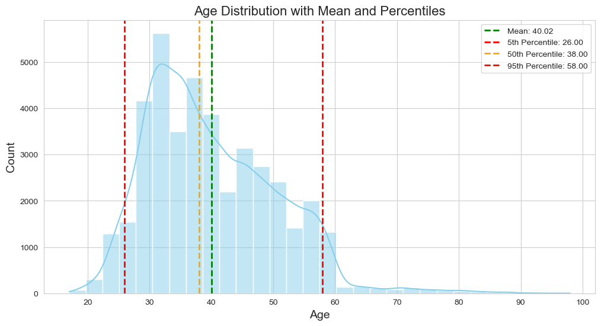

# Bank Marketing Campaign Analysis Report

## Overview

This report details the analysis of the Bank Marketing dataset from the UCI Machine Learning Repository. The goal of this analysis is to provide insights and segmentation of the bank's marketing campaigns and customer base using various data science techniques. The analysis is divided into three main sections:

1. Data Cleansing & Exploration
2. Campaign Segmentation
3. Customer Segmentation using Unsupervised Learning

## Dataset

The dataset used in this analysis can be found [here](https://archive.ics.uci.edu/dataset/222/bank+marketing).

## 1. Data Cleansing & Exploration

### Objectives

- Remove any inconsistencies and missing values from the dataset.
- Conduct exploratory data analysis (EDA) to understand the key features and their distributions.
- Visualize the data to identify any patterns or insights that can inform subsequent analyses.

### Key Steps

- **Data Cleaning**: Handling missing values, outlier detection, and removal.
- **Descriptive Statistics**: Calculating mean, median, mode, and other summary statistics.
- **Data Visualization**: Creating plots such as histograms, bar charts, and scatter plots to visualize the distribution and relationships of variables.

### Results
#### Outliers

It doesn't seem like there is any proof that the outlier will interfere with the analysis since:
  1. The outlier is not skewing the data dsitribution too much. This can be seen by comparing the median and average value.  
  *Since 0.78 is greater than 0, the distribution is positively skewed. The value 0.78 indicates a moderate degree of skewness. It’s not extremely skewed, but it’s noticeably asymmetrical.*  
    
  2. There are a lot of outliers, but the moajority of the data can still be considered to be distributed normally. I might lose important information if I decide to filter out the outliers.  

#### Contact frequency
  
The bar graph compares the preferred banking channels used by customers, specifically cellular versus telephone, by counting the contact frequency and ranking the top choice for each customer. Here are the insights and analysis based on the graph:

1. Preference for Cellular Contacts: 
- The bar graph shows that cellular contacts are significantly higher than telephone contacts.
- **This indicates a strong preference among customers for being contacted via their mobile phones**.

2. Customer Accessibility: 
- The higher count for cellular suggests that customers **may find mobile communication more accessible and convenient**, allowing them to respond more quickly and at any location.

3. Marketing Strategy: 
- Given the higher preference for cellular contacts, banking institutions might consider focusing more of their marketing efforts and resources on mobile communication channels.
- **Mobile-specific campaigns, such as SMS marketing or app notifications, might be more effective**.

4. Engagement and Reach: 
- The data suggests that using cellular channels **might result in higher engagement rates**, as more customers prefer this mode of communication.
- Banks could enhance their reach by integrating mobile-first strategies.

#### Campaign conversion rate

Insights
1. Initial Success: 
- The **initial** campaigns were both **highly effective** (high conversion rates) and had **high engagement** (high number of responded customers). This indicates **successful marketing efforts during the early stages**.
2. Decreasing Effectiveness: 
- The drop in both conversion rates and the number of responded customers in later campaigns suggests a **need to revisit and potentially revamp** the marketing strategy. This could involve targeting new segments, refreshing the campaign content, or adjusting the communication approach.
3. Optimization Opportunities: 
- **Analyzing what made the initial campaigns successful** could provide insights into improving future campaigns. Factors such as campaign content, timing, targeting, and communication channels should be reviewed.
4. Customer Fatigue: 
- The sharp decline in responses might indicate customer fatigue, where **repeated** campaigns have **diminished** returns. This could necessitate a more personalized or varied approach to keep the audience engaged.

Recommendations
1. Review Initial Campaigns: **Study the initial** successful campaigns to understand the key factors that drove high conversion rates and engagement.
2. Diversify Strategies: Implement **varied marketing strategies** for different customer segments to avoid fatigue and increase engagement.
3. Monitor and Adjust: Continuously **monitor** campaign performance and be ready to adjust strategies based on real-time feedback and data.
4. Target New Segments: Consider **expanding** the target audience to include new customer segments that have not been reached by previous campaigns.

## 2. Campaign Segmentation

### Objectives

- Identify distinct groups of marketing campaigns based on engagement and conversion rates.
- Evaluate the performance of each segment to derive actionable insights for optimizing future campaigns.
- Understand customer engagement patterns and their impact on campaign success.

### Key Steps

- **Data Preparation**: Cleaning and preprocessing the data to ensure it is suitable for clustering.
- **Feature Engineering**: Creating new features that better represent campaign characteristics, such as engagement categories and conversion rates.
- **Performance Analysis**: Comparing the conversion rates and customer engagement across different segments to determine the effectiveness of each campaign strategy.

### Results
| campaign | engagement category | customer count | responded customers | total customer | campaign conversion rate | percentage |
|----------|---------------------|--------------|---------------------|-----------------------|-------------------|------------|
| 1        | Highly engaged      | 1161         | 1645                | 6565                  | 0.250571          | 0.176847   |
|         | Low engagement      | 79           | 1645                | 6565                  | 0.250571          | 0.012034   |
|         | Moderately engaged  | 405          | 1645                | 6565                  | 0.250571          | 0.061691   |
| 2        | Highly engaged      | 784          | 994                 | 4973                  | 0.199879          | 0.157651   |
|         | Low engagement      | 20           | 994                 | 4973                  | 0.199879          | 0.004022   |
|         | Moderately engaged  | 190          | 994                 | 4973                  | 0.199879          | 0.038206   |
| 3        | Highly engaged      | 427          | 511                 | 3153                  | 0.162068          | 0.135427   |
|         | Low engagement      | 2            | 511                 | 3153                  | 0.162068          | 0.000634   |
|         | Moderately engaged  | 82           | 511                 | 3153                  | 0.162068          | 0.026007   |
| 4        | Highly engaged      | 211          | 241                 | 1928                  | 0.125000          | 0.109440   |
|         | Moderately engaged  | 30           | 241                 | 1928                  | 0.125000          | 0.015560   |
| 5        | Highly engaged      | 104          | 117                 | 1252                  | 0.093450          | 0.083067   |
|         | Moderately engaged  | 13           | 117                 | 1252                  | 0.093450          | 0.010383   |
| 6        | Highly engaged      | 62           | 74                  | 843                   | 0.087782          | 0.073547   |
|         | Moderately engaged  | 12           | 74                  | 843                   | 0.087782          | 0.014235   |
| 7        | Highly engaged      | 35           | 38                  | 566                   | 0.067138          | 0.061837   |
|         | Moderately engaged  | 3            | 38                  | 566                   | 0.067138          | 0.005300   |
| 8        | Highly engaged      | 16           | 17                  | 367                   | 0.046322          | 0.043597   |
|         | Moderately engaged  | 1            | 17                  | 367                   | 0.046322          | 0.002725   |
| 9        | Highly engaged      | 17           | 17                  | 270                   | 0.062963          | 0.062963   |
| 10       | Highly engaged      | 12           | 12                  | 215                   | 0.055814          | 0.055814   |
| 11       | Highly engaged      | 12           | 12                  | 169                   | 0.071429          | 0.071429   |
| 12       | Highly engaged      | 3            | 3                   | 121                   | 0.024793          | 0.024793   |
| 13       | Highly engaged      | 4            | 4                   | 89                    | 0.044944          | 0.033708   |
| 13       | Moderately engaged  | 4            | 4                   | 89                    | 0.044944          | 0.011236   |
| 14       | Highly engaged      | 1            | 1                   | 66                    | 0.015152          | 0.015152   |
| 15       | Highly engaged      | 2            | 2                   | 51                    | 0.039216          | 0.039216   |
| 17       | Highly engaged      | 4            | 4                   | 58                    | 0.068966          | 0.068966   |
| 23       | Highly engaged      | 1            | 1                   | 16                    | 0.062500          | 0.062500   |

  

Based on the graph, the campaign that gives the highest probability of engagement is **Campaign 1**. This is indicated by the tallest bar, particularly for the **"Highly engaged"** category, which shows a **high percentage** relative to other campaigns. The significant height of the bars for **Campaign 1** across all engagement categories suggests it has a **higher probability of engaging customers compared to other campaigns**.  

## 3. Customer Segmentation using Unsupervised Learning

### Objectives

- Segment the bank's customer base to identify distinct groups with similar characteristics.
- Utilize these segments for targeted marketing and personalized services.
- Understand the demographic and behavioral patterns of different customer segments.

### Key Steps

- **Data Preparation**: Cleaning and preprocessing the data to ensure it is suitable for clustering.
- **One-Hot Encoding**: Converting categorical variables into binary columns to facilitate the clustering process.
- **Clustering Algorithm**: Using K-Modes algorithm to cluster categorical data, which is more suited for this type of data than K-Means.
- **Cluster Simulation**: Simulating different scenarios by clustering the data into 2 to 8 clusters and evaluating the cost.
- **Elbow Method**: Finding the optimal number of clusters by identifying the point where the diminishing returns on cost start to level off.
- **Cluster Analysis**: Analyzing the characteristics of each customer segment to understand their unique attributes.

### Results
| Variable |1 |2 | 3| 4|
|-|-|-|-|-|
|`age`| 30-60 | 30-60 | 20-40 | 40-50 |
|`job`| admin, blue-collar, technician | admin, blue-collar, technician | services, student | admin, blue-collar, technician|
|`marital`| divorced, married | divorced, married | single | divorced, married |
|`education`| high-school, university | high-school, university | high-school, university | high-school, university |
|`default`| no | no | no | unknown default |
|`housing`| no | yes | no, yes | yes |
|`loan`| no | no | no | yes |

- Identification of distinct customer segments.
- Detailed profiles of each segment to inform targeted marketing strategies and personalized customer interactions.

## Conclusion

This comprehensive analysis of the Bank Marketing dataset provides significant insights into the bank's marketing campaigns and customer base. The report is divided into three key sections: Data Cleansing & Exploration, Campaign Segmentation, and Customer Segmentation using Unsupervised Learning. Each section has been meticulously crafted to address specific objectives and employ robust methodologies to derive actionable insights.

### Data Cleansing & Exploration

In this section, I ensured the dataset's quality by addressing inconsistencies and missing values. Through descriptive statistics and data visualization, I gained a thorough understanding of the key features and their distributions. This foundational step was crucial for the subsequent analyses.

### Campaign Segmentation

By segmenting the marketing campaigns, I identified distinct groups with similar characteristics. Using clustering techniques like K-Means, I grouped the campaigns and analyzed their performance. This segmentation revealed valuable insights into campaign effectiveness and customer engagement, providing a basis for optimizing future marketing strategies.

### Customer Segmentation using Unsupervised Learning

I applied the K-Modes algorithm to segment the customer base into distinct groups based on demographic and behavioral attributes. This method, well-suited for categorical data, enabled me to uncover meaningful patterns in customer engagement and conversion rates. The identified segments offer a clear understanding of different customer profiles, aiding in targeted marketing and personalized service delivery.

### Strategic Recommendations

1. **Targeted Campaigns**: Utilize the insights from campaign segmentation to design targeted campaigns for each segment, focusing on the characteristics that drive engagement and conversions.
2. **Personalized Marketing**: Leverage the customer segments identified to tailor marketing messages and offers to different customer profiles, enhancing personalization and customer satisfaction.
3. **Continuous Monitoring**: Implement a continuous monitoring system to track the performance of different segments and adjust strategies in real-time based on customer responses and market conditions.

By leveraging data-driven insights and advanced analytical techniques, the bank can significantly enhance its marketing effectiveness and customer relationship management. This report provides a strategic roadmap for achieving these goals, driving both customer satisfaction and business growth.

## Notebooks
More detailed process can be seen in the notebook:
- [Cleansing & Exploration.ipynb](Cleansing%20&%20Exploration.ipynb)
- [Campaign Segmentation.ipynb](Campaign%20Segmentation.ipynb)
- [Customer Segmentation Unsupervised Learning.ipynb](Customer%20Segmentation%20Unsupervised%20Learning.ipynb)

## References

- [Bank Marketing Dataset - UCI Machine Learning Repository](https://archive.ics.uci.edu/dataset/222/bank+marketing)
